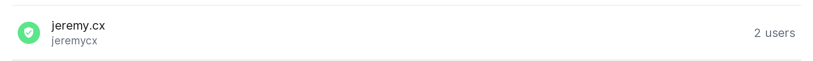

# Signal Sciences TA for Splunk App

This app for Splunk connects to the Signal Sciences API in order to pull data into Splunk. 

## LOOK HERE FIRST
---
**This app is not maintained by Fastly**
**This app is open source and maintained by @jeremy-cxf**
**Please do not use Fastly official support channels for support, you will simply be referred here.** 
**If you have an issue please raise it on github issues. I maintain this in my spare time, so please be patient if I haven't seen it.**

---

## Overview.

The ngwaf-splunk-ta polls in configured intervals to the following endpoints:

1. https://dashboard.signalsciences.net/api/v0/corps/{{corp}}/sites/{{site}}/analytics/events
2. https://dashboard.signalsciences.net/api/v0/corps/{{corp}}/sites/{{site}}/feed/requests
3. https://dashboard.signalsciences.net/api/v0/corps/{{corp}}/activity

Information about API Tokens can be found at https://docs.signalsciences.net/developer/using-our-api/

## Pre-requsites

Before you begin the install, you'll need the following:

Your:
- Corp name. 
- Site name (for the request feed input module)
- API token (of a user with read permissions)

The Corp name and Dashboard Site names are in the URL for the dashboard. 
The sitename must be in "shortname" format (e.g no special characters).

The easiest way is often retrieving it from the URL bar of your preferred browser when viewing a site e.g:
`https://dashboard.signalsciences.net/corps/{CORP_NAME}/sites/{site_api_name}`

You can also get the site name from the Manage Sites menu if you are a user who has read permissions to a corp/site. This can be done via going to: `Corp Tools` -> `Manage Sites` and using the lowercase name under the display name in the menu.

For example, the sitename in this instance is `jeremycx`

Information about obtaining API Tokens can be found at https://docs.signalsciences.net/developer/using-our-api/.
Generally they can be created is under the hamburger menu "My account => API Tokens"

## Indexes
The Technical Adapter does not create an index by default.

## Configuration 1.0.37 or higher

Once the Splunk App has been installed you will need to configure the shared settings and then the Modular Data inputs.

1. Log into your Splunk Web Portal
2. Select the ngwaf_TA_for_splunk

   
    
3. Click on "Configuration"
4. Click on "Add-on Settings"
5. Fill in the Signal Sciences user (Email Address), Password or API Token, and the Singal Sicences corp name.

   * **Email Address:** This is the username/email address for the Signal Sciences dashboard
   * **API Token:** This is required and should be a token associated with your e-mail address
   * **Corp Name** This is the API id for the corp which we obtained above.

   

6. Click Save
7. Click on "Input"
8. Click on "Create New Input"

   

9. Chose either "Sigsci Requests" or "Sigsci Event" or "Sigsci Activity"
10. Fill in the Input settings

    * **Name:** This is the unique name you would like to give the input
    * **index:**  This is the index that will store the data on splunk, you can use `default`
    * **Time Delta in Seconds:** This is the time period, in seconds, that the script will pull. This should generally be left at the default which is 300 and matches the interval for the input.
    * **Interval:** This is the interval frequency the script runs in, in seconds. This should be the same as the delta and is recommended to leave at 300
    * **Site API Name:** This is the API Name for the dashboard it could be something like `app-prod`

Screenshot here.

---

# Behaviour

Each input module will run at each interval configured. There are exceptions with the request feed input, which will always be 5minutes behind due to the time it can take to propagate events in the request feed after collection.

If you need "real-time" logging for an on-prem agent, then it best to use `waf-data-log` on the agent and use a splunk collector to export this.

## Catch Up Mode

This behaviour lingers on from the original incantation of the application. 
I consider it a bit of an anti pattern and don't recommend using it.

- When this is `true` the following will occur:
- The TA will always use the last timestamp stored.
- Due to API requirements, the `from` timestamp cannot be older than 24 hours. In the condition the last stored timestamp is over 24 hours, then it will reset to exactly 24 hours ago and try to catch up.

I do not recommend this setting in the use case of the app having to paginate alot of requests. 

## Attack and Anomaly Signals Only

This is useful to setup as a seperate input module if you're wanting to aggregate both your normal request feed, and one only with attack signals in. This could be useful for monitoring / alerting. However, note that the NGWAF dashboard should not be considered a replacement of proper logging of your access logs or CDN service, and should be used in conjunction with them for non-anomalous traffic. Excessive signals reduces visibility.

## Updating the App

This can be done in the UI via downloading the new version from splunkbase, same as you would any other plugin.